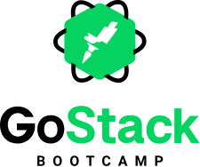

<h1 align="center">
	
</h1>

<h3 align="center">
  GoBarber ✂️
</h3>

<p align="center">
  
  
  
  
  
  
  <a href="https://github.com/EliasGcf/gobarber/commits/master">
    
  </a>
  
  <a href="https://github.com/EliasGcf/gobarber/issues">
    
  </a>
  
  
</p>

<p align="center">
  <a href="#-instalação-execução-e-desenvolvimento">Instalação, execução e desenvolvimento</a>&nbsp;&nbsp;&nbsp;|&nbsp;&nbsp;&nbsp;
  <a href="#-como-contribuir">Como contribuir</a>&nbsp;&nbsp;&nbsp;|&nbsp;&nbsp;&nbsp;
  <a href="#-licença">Licença</a>
</p>

## 💻 Instalação, execução e desenvolvimento

### Pré-requisitos

- [Node.js](https://nodejs.org/en/)
- [Yarn](https://yarnpkg.com/)
- [PostgreSQL](https://www.postgresql.org/)
- [MongoDB](https://www.mongodb.com/)

**Faça um clone desse repositório**

### Backend

- A partir da raiz do projeto, entre na pasta do backend rodando `cd backend`;
- Rode `yarn` para instalar as dependências;
- Crie um banco de dados no `postgres` com o nome de `gobarber`;
- Rode `cp .env.example .env` e preencha o arquivo `.env` com **SUAS** variáveis ambiente;
- Rode `yarn sequelize db:migrate` para executar as migrations;
- Rode `yarn dev` para iniciar o servidor.

### Web

_ps: Antes de executar, lembre-se de iniciar o backend deste projeto_

- A partir da raiz do projeto, entre na pasta do frontend web rodando `cd frontend`;
- Rode `yarn` para instalar as dependências;
- Rode `yarn start` para iniciar o client.

### Mobile

_ps: Antes de executar, lembre-se de iniciar o backend deste projeto_

- A partir da raiz do projeto, entre na pasta do frontend mobile rodando `cd mobile`;
- Rode `yarn` para instalar as dependências;
- Rode `yarn react-native run-ios` ou `yarn react-native run-android` dependendo do SO.

## 🤔 Como contribuir

- **Faça um fork deste repositório**

```bash
# Fork via GitHub official command line

$ gh repo fork EliasGcf/gobarber
```

```bash
# Clone o seu fork
$ git clone url-do-seu-fork && cd gobarber

# Crie uma branch com sua feature
$ git checkout -b minha-feature

# Faça o commit das suas alterações
$ git commit -m 'feat: Minha nova feature'

# Faça o push para a sua branch
$ git push origin minha-feature
```

Depois que o merge da sua pull request for feito, você pode deletar a sua branch.

## 📝 Licença

Esse projeto está sob a licença MIT. Veja o arquivo [LICENSE](LICENSE) para mais detalhes.

---

Feito com 💜 by [EliasGcf](https://www.linkedin.com/in/eliasgcf/)
